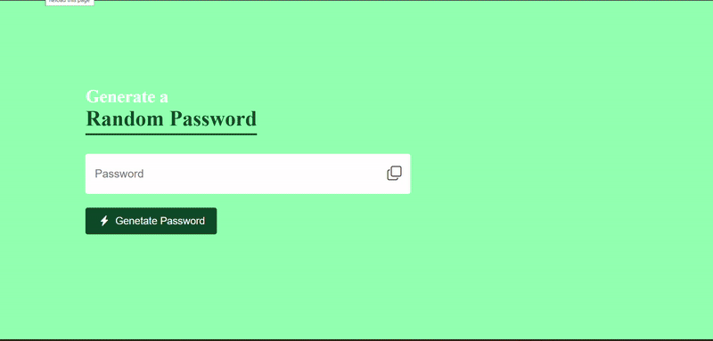
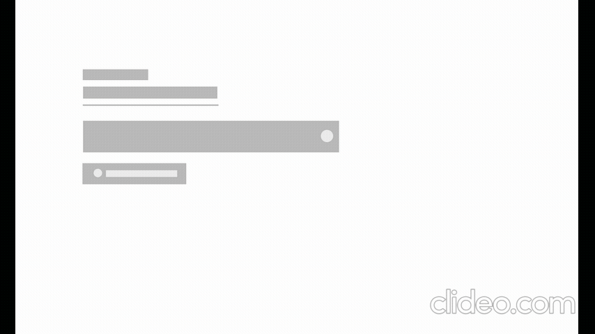
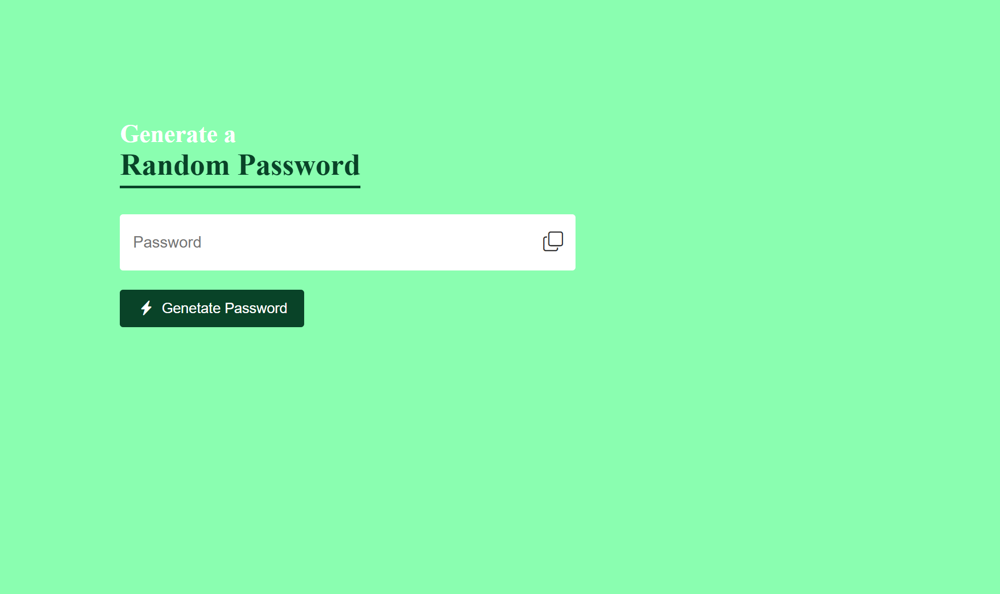
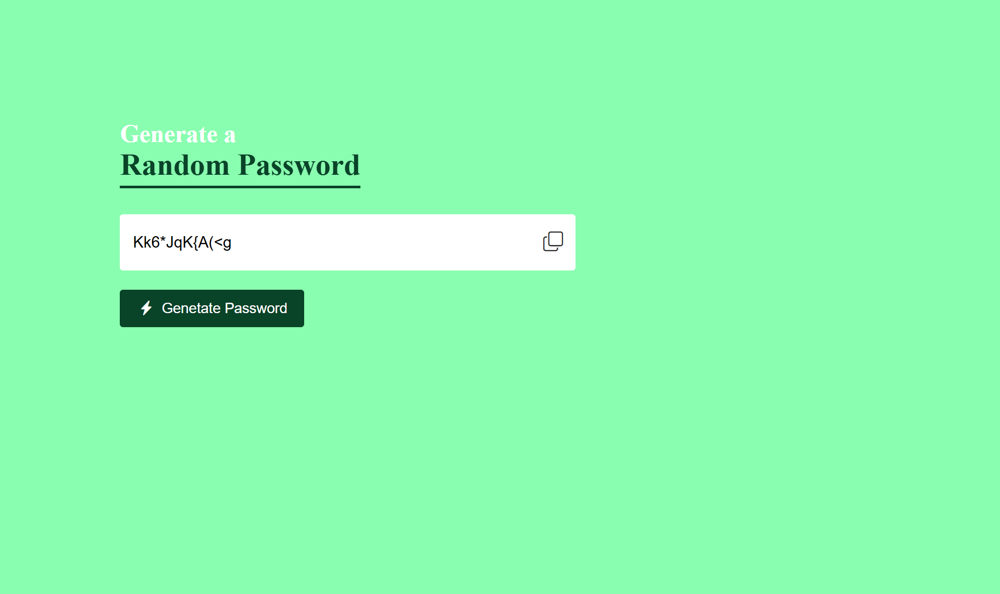
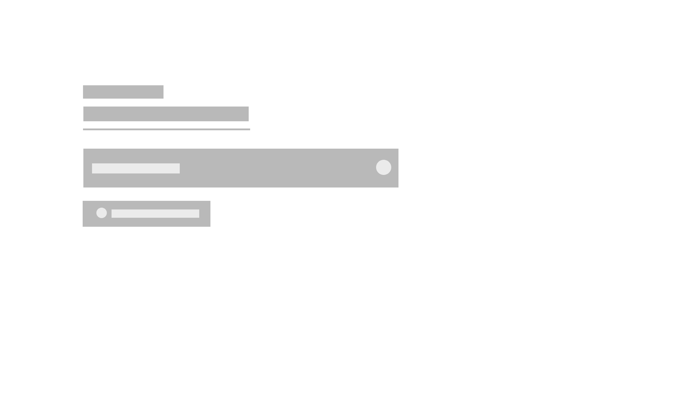
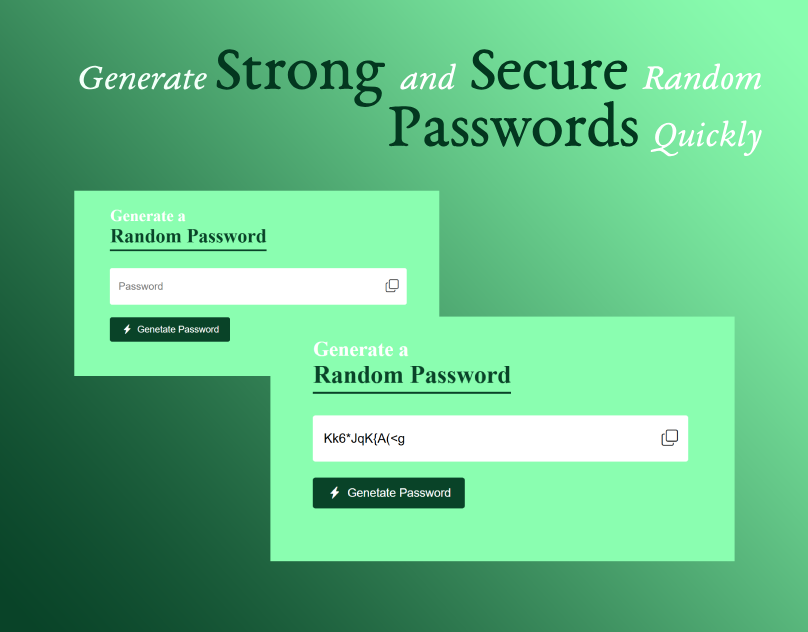

## QuickPass Generator for Enhanced User Experience
<a href="https://www.linkedin.com/in/dharmendraverma95/" target="_blank">LinkedIn Profile </a>

<a href="https://www.behance.net/dhirukumar" target="_blank">Behance Profile </a>

## Project Overview
QuickPass Generator is a simple and easy-to-use web tool that helps you create strong, random passwords to enhance your online security. It generates secure passwords quickly, ensuring your personal and professional accounts are well protected from unauthorized access.

## Features
- Quick Generation: Generate strong and random passwords in seconds.
- Customization: Choose the length and complexity of the generated passwords.
- Security First: Designed to create highly secure passwords for all types of online accounts.
- No Signup Required: Use the tool instantly without needing to create an account.
  

###### Lang
<ul>
  <li>HTML5</li>
  <li>CSS3</li>
  <li>Bootstrap Icon</li>
  <li>ChatGPT [For Content]</li>
  <li>ui / ui layout Design</li>
  <li>desgin in Abode XD</li>
</ul>

 
Desktop Design 

 
Desktop UI UX Design 

 
Desktop Design ui-ux Layout 

 
Desktop Design 

Cover 
